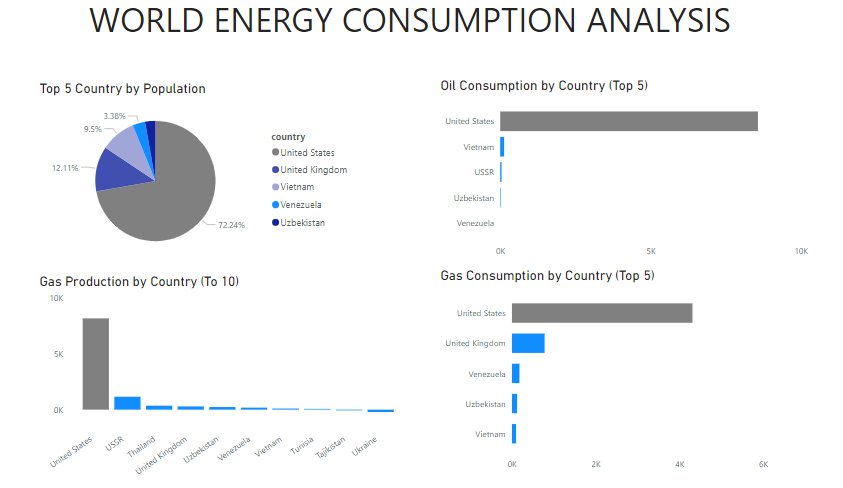

# World Energy Consumption Analysis

***
## Introduction
Welcome to a comprehensive analysis of **world energy consumption**. in an era marked by increasing concerns about environmental sustainability and energy security, understanding the dynamics of global energy comsumption is of paramount importance. This is a power Bi project on world energy consumption. This project is to analyze world energy conssumption data to identify the consumption of energy sources by countries for a more sustainable global energy future.

## Problem Statement
1. What is the most populated country?
2. What are the top 5 countries with the highest oil consumption?
3. Which countries are in the top 10 for gas production?
4. What are the top 5 countries in gas consumption?

## Skills:
- Data Cleaning and preprocessing,
- Data Modeling,
- Data Visualization,
- DAX,
- Filters,
- Dashboard Design,
- Understanding Energy Data,
- Problem Solving

 ## Data Exploration
This stage involves familiarizing myself with the dataset. It allows me understand the data, identify columns that need cleaning, and determine if the dataset includes the necessary columns to answer important case questions.
The table has 74 columns and 1650 rows.

## Data Preparation and Cleansing
This is where I prepared the dataset for analysis, addressing all observations during the exploration stage. 
  - Identified and removed null values from gas consumption column to avoid inaccuracies.
  - Filtered data from oil consumption column that are significantly different from the rest of the dataset.
  - Ensured the data types are consistent.
  - It was observed that the gas production column data type was text. So I had to change it to a whole number.
  - Standardized date formats to ensure consistency and enable date-based calculations.
  - Removed spaces,special characters in country column to make them uniform.
    
    
## Visualization and Analysis
This is where I begin answering the questions provided. I utilized pie and bar charts to generate insights and visually represent the data.

- It was discovered that the United States has the highest population, followed by the United Kingdom, Vietnam, Venezuela and Uzbekistan.

- In terms of oil consumption, the analysis reveals that the United States consumes the most, followed by Vietnam, the USSR, Uzbekistan and Venezuela, who consume the least.

- Among the top gas-producing countries, the United States has the highest production.

- The United States consumes the most gas, followed by the United Kingdom, Venezuela, Uzbekistan, and Vietnam.

##  Recommendations
   - Energy Efficiency Measures:
   Given the United States' high consumption of oil and gas, it is essential to implement rigorous energy efficiency measures at the national level. This could involve promoting the 
   use of cleaner and more energy-efficient technologies to reduce environmental impact and dependance on fossils fuels.
   - Global Cooperation:
   As a leading consumer and producer of energy resources, the United States should actively engage in international cooperation to address energy-related challenges. Collaborative 
   efforts on clean energy research, development, and deployment can contribute to a more sustainable future.
   - Monitoring and Conservative:
   All countries, especially those with high consumption rates, should implement robust monitoring systems to track resouce utilization and promote conservation efforts. This can 
   help extend the lifespan of finite resources and minimize environmental impacts.
   - Education and Awareness:
  Raising public awareness about importance of energy consumption and responsible consumption is crucial. Goverments and organizations should invest in educational programs to empower 
  citizens with the knowledge and tools to make informed choices regarding energy use.

  ##  Conclusion
  The United States dominates in terms of population, oil consumption, and gas consumption and production, it should prioritize sustainability and cooperation to address global energy 
  challenges effectively. Implementing these recommendations can contribute to a more balanced and environmentally friendly energy landscape.
  
 

 
