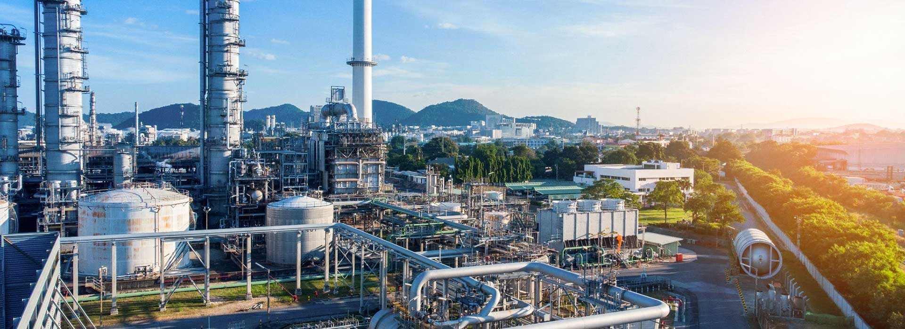

# World Energy Consumption Analysis

***
## Introduction
Welcome to a comprehensive analysis of **world energy consumption**. in an era marked by increasing concerns about environmental sustainability and energy security, understanding the dynamics of global energy comsumption is of paramount importance. This is a power Bi project on world energy consumption. This project is to analyze world energy conssumption data to identify the consumption of energy sources by countries for a more sustainable global energy future.

## Problem Statement
1. What is the most populated country?
2. What are the top 5 countries with the highest oil consumption?
3. Which countries are in the top 10 for gas production?
4. What are the top 5 countries in gas consumption?

## Skills:
- Data Cleaning and preprocessing,
- Data Modeling,
- Data Visualization,
- DAX,
- Filters,
- Dashboard Design,
- Understanding Energy Data,
- Problem Solving

 ## Data Exploration
This stage involves familiarizing myself with the dataset. It allows me understand the data, identify columns that need cleaning, and determine if the dataset includes the necessary columns to answer important case questions.
The table has 74 columns and 1650 rows.

## Data Preparation and Cleansing
This is where I prepared the dataset for analysis, addressing all observations during the exploration stage. 
  - Identified and removed null values from gas consumption column to avoid inaccuracies
  - Filtered data from oil consumption column that are significantly different from the rest of the dataset
  - Ensured the data types are consistent
  - It was observed that the gas production column data type was text. So I had to change it to a whole number.
  - Standardized date formats to ensure consistency and enable date-based calculations
  - Removed spaces,special characters in country column to make them uniform
    
    
## Visualization and Analysis
The cleaned dataset was visualized using Power BI. 

 

 
